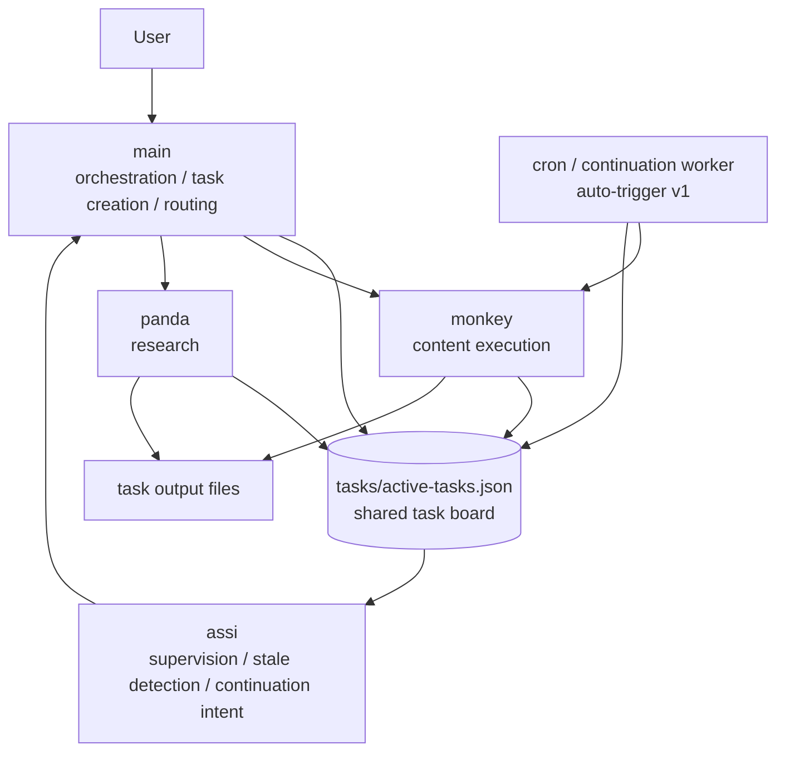

# openclaw-task-continuation

[中文说明](./README.md) | English

A **multi-agent long-task continuation workflow** for OpenClaw.

It is designed to solve one very specific problem:

> Long-running agent tasks should not stall after one step.
> The system should supervise, continue, and update state instead of waiting for the user to ask for progress.

---

## What this is

This is not a standalone app.

It is a set of **workflow docs, task-board conventions, and agent role definitions** intended to be adapted into an OpenClaw workspace.

Current 4-agent split:

- `main` — orchestration, task creation, summaries, continuation routing
- `monkey` — content execution
- `panda` — research / information gathering
- `assi` — supervision, stale detection, continuation intent generation

---

## Architecture / Flow

### In one sentence

- `main` creates, routes, and summarizes tasks
- `monkey/panda` execute and write state back
- `assi` watches the board and decides when a task has gone stale
- the `cron worker` provides the current v1 automatic continuation path

---

## What is already working

Working pieces validated so far:

- Shared task board for long-running tasks
- Documented task lifecycle and continuation rules
- `monkey` execution path validated under `MiniMax-M2.5`
  - can spawn
  - can read files
  - can write files
  - can write back task state
- `assi` supervision path validated
  - can read the task board
  - can identify running / stale tasks
  - can produce supervision messages
  - can form continuation instructions
- `main` continuation router rules documented and tested manually
- A working **auto-trigger v1** approach using a continuation worker cron job

---

## What is not fully finished yet

The ideal full automatic chain is:

`assi -> main -> monkey`

That more elegant end-state is documented, but the currently stable automatic version is still the simpler **worker-based v1** approach.

So the honest summary is:

- **usable in practice already**
- **still architecturally incomplete in its final form**

---

## Repository layout

- `MULTI_AGENT_WORKFLOW.md` — top-level entry document
- `context/` — orchestration, routing, and auto-loop notes
- `tasks/` — task board format, workflow, continuation spec, examples
- `workspace-assi-context/` — supervision / continuation docs for assi
- `workspace-monkey-context/` — execution role notes for monkey
- `workspace-panda-context/` — research role notes for panda

---

## Recommended reading order

1. `MULTI_AGENT_WORKFLOW.md`
2. `context/agent-orchestration-overview.md`
3. `tasks/workflow.md`
4. `tasks/continuation-spec.md`
5. `context/main-continuation-router.md`

---

## Good fit for

- long writing tasks
- slide / PPT drafting
- batches of Xiaohongshu topics or content ideas
- research → organize → output workflows
- any multi-stage task that usually cannot finish in one turn

Not a great fit for:

- tiny one-shot tasks
- simple queries with no need for state tracking

---

## Current auto-trigger status

### Already available
- continuation worker cron pattern
- stale task detection
- task state write-back
- basic automatic continuation ability

### Still to improve
- fully automatic `assi -> main -> monkey` loop
- more stable multi-agent forwarding and scheduling
- better path abstraction for reuse outside the original workspace

---

## Roadmap

### v0.1
- [x] task board introduced
- [x] monkey execution chain validated
- [x] assi supervision chain validated
- [x] main continuation router documented
- [x] workflow entrypoints organized

### v0.2
- [x] auto-trigger v1 (worker-based)
- [x] `/new` recovery entrypoints documented
- [x] repo extracted and published

### v0.3
- [ ] complete the formal `assi -> main -> monkey` automatic loop
- [ ] reduce reliance on manual forwarding/debug intervention
- [ ] abstract local absolute paths into reusable templates
- [ ] add clearer task state evolution examples

### v0.4
- [ ] support more execution agents beyond monkey
- [ ] support richer stale-detection policies
- [ ] generalize the continuation router
- [ ] add demo / walkthrough material

---

## Intended use

This repository is best treated as:

- a reference template for an OpenClaw workspace
- a starting point to adapt into your own agent layout
- a documented workflow skeleton that can be gradually automated further

It is not meant to be a polished turnkey product.

---

## Note

Some documents still include original local absolute path examples. Adjust them to match your own workspace before reuse.
