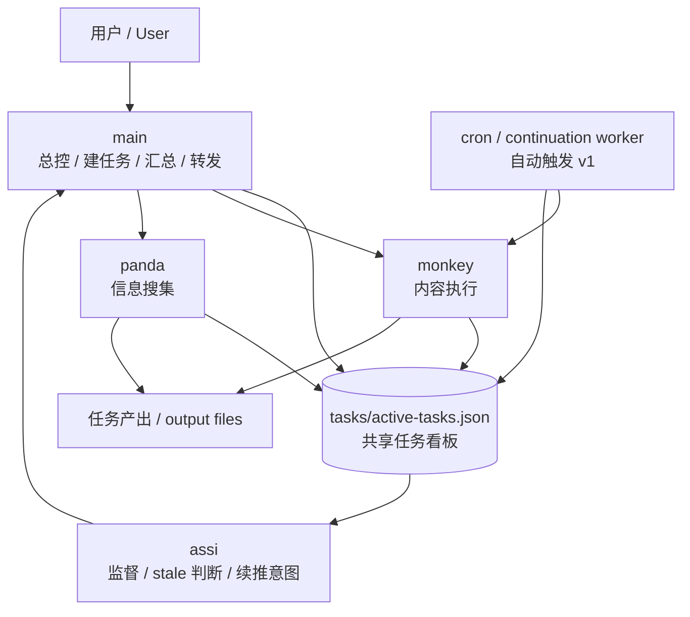

# openclaw-task-continuation

中文说明 | [English](./README.en.md)

一个给 OpenClaw 用的**多 agent 长任务续推工作流**。

它解决的核心问题很直接：

> 长任务别做一会儿就停。
> 不要等用户追问“进展呢”，系统自己要能监督、续推、回写状态。

---

## 这是什么

这不是一个独立应用，而是一套可以放进 OpenClaw workspace 里的**工作流文档 + 任务看板规范 + 角色分工约定**。

当前采用 4 个 agent 分工：

- `main`：总控 / 建任务 / 汇总 / 续推转发
- `monkey`：内容执行
- `panda`：信息搜集
- `assi`：监督 / stale 判断 / 续推意图生成

---

## 架构图 / 流程图

### 一句话理解

- `main` 负责建任务、分派和汇总
- `monkey/panda` 负责干活并回写状态
- `assi` 负责盯看板，判断任务有没有停住
- `cron worker` 负责在 v1 里做自动续推

---

## 快速开始

如果你想把这套东西快速塞进自己的 OpenClaw workspace，建议按这个顺序：

### 1. 先把文档放进 workspace
至少放这些：

- `MULTI_AGENT_WORKFLOW.md`
- `context/agent-orchestration-overview.md`
- `context/main-continuation-router.md`
- `tasks/workflow.md`
- `tasks/continuation-spec.md`

### 2. 准备一个共享任务看板
核心文件：

- `tasks/active-tasks.json`

最小字段建议包括：

- `task_id`
- `title`
- `owner_agent`
- `status`
- `current_step`
- `last_progress_at`
- `next_action`
- `summary`
- `continuation_mode`
- `continue_target`
- `continue_brief`
- `stale_after_minutes`

### 3. 给 agent 分角色
最低建议：

- `main` 负责总控和转发
- `monkey` 负责内容执行
- `panda` 负责资料搜集
- `assi` 负责监督和续推判断

### 4. 先打通一条最小链路
推荐先验证：

- `monkey` 能否被拉起
- `monkey` 能否读共享看板
- `monkey` 能否写文件
- `monkey` 能否回写任务状态
- `assi` 能否读看板并生成监督消息

### 5. 再接自动触发
建议先从 **worker-based v1** 开始，而不是一上来追求最优雅的完整自动闭环。

---

## 已经实现了什么

目前已经打通的部分：

- 长任务共享看板机制
- 任务生命周期与 continuation 规则文档
- `monkey` 在 `MiniMax-M2.5` 下的执行链验证通过
  - 能拉起
  - 能读文件
  - 能写文件
  - 能回写共享任务状态
- `assi` 的监督链验证通过
  - 能读看板
  - 能识别 running / stale 任务
  - 能生成监督消息
  - 能形成续推指令
- `main` 续推转发器规则已落地
- 自动触发版 **v1** 已有可运行方案（continuation worker cron job）

---

## 现在还没完全做完的

当前最理想的完整自动链是：

`assi -> main -> monkey`

这套**正式版自动闭环**的规则和文档已经写好，
但当前稳定可用的自动版本，还是更务实的 **v1 worker-based** 方案。

一句话：

- **功能上已经可用**
- **架构上还有更优雅的 v2 可以继续做**

---

## 仓库结构

- `MULTI_AGENT_WORKFLOW.md` —— 总入口文档
- `context/` —— 编排、路由、自动闭环建议
- `tasks/` —— 任务看板格式、workflow、continuation spec、示例
- `workspace-assi-context/` —— assi 的监督 / 续推文档
- `workspace-monkey-context/` —— monkey 的执行角色文档
- `workspace-panda-context/` —— panda 的信息搜集角色文档

---

## 推荐阅读顺序

如果你是第一次看这套东西，建议按这个顺序：

1. `MULTI_AGENT_WORKFLOW.md`
2. `context/agent-orchestration-overview.md`
3. `tasks/workflow.md`
4. `tasks/continuation-spec.md`
5. `context/main-continuation-router.md`

---

## 适合什么场景

这套流程适合：

- 写长文
- 写一整套 PPT
- 生成一批小红书选题 / 文案
- 资料搜集 + 整理 + 输出
- 多阶段任务，且通常一轮做不完

不适合：

- 一句话就能完成的小任务
- 完全不需要状态跟踪的临时查询

---

## 当前自动触发版状态

### 已有
- 基于 cron 的 continuation worker 思路
- stale 任务识别
- 任务状态回写
- 自动续推基础能力

### 仍待继续优化
- 更优雅的 `assi -> main -> monkey` 全自动正式闭环
- 更稳定的多 agent 转发与调度策略
- 更通用的 repo 化与路径抽象

---

## Roadmap

### v0.1
- [x] 任务看板落地
- [x] monkey 执行链打通
- [x] assi 监督链打通
- [x] main 续推转发规则落地
- [x] 文档入口整理

### v0.2
- [x] 自动触发版 v1（worker-based）
- [x] /new 后恢复入口补齐
- [x] 仓库化整理并发布

### v0.3
- [ ] 正式完成 `assi -> main -> monkey` 自动闭环
- [ ] 减少对人工转发/调试的依赖
- [ ] 把本地绝对路径抽象成可复用模板
- [ ] 增加更清晰的“任务状态演进示例”

### v0.4
- [ ] 支持更多执行 agent（不只是 monkey）
- [ ] 支持更细的 stale 判定策略
- [ ] 支持更通用的 continuation router
- [ ] 补 demo / walkthrough

---

## 使用方式

这套仓库更适合：

- 作为 OpenClaw workspace 的参考模板
- 按你的 agent 命名和目录结构改造后落地
- 逐步把文档规则变成更自动化的调度链

它不是“下载即用的完整产品”，而是一个已经跑通过的**工作流骨架**。

---

## 注意

当前文档里仍保留了一些原始本地路径示例，复用时请按你的实际 workspace 调整。
